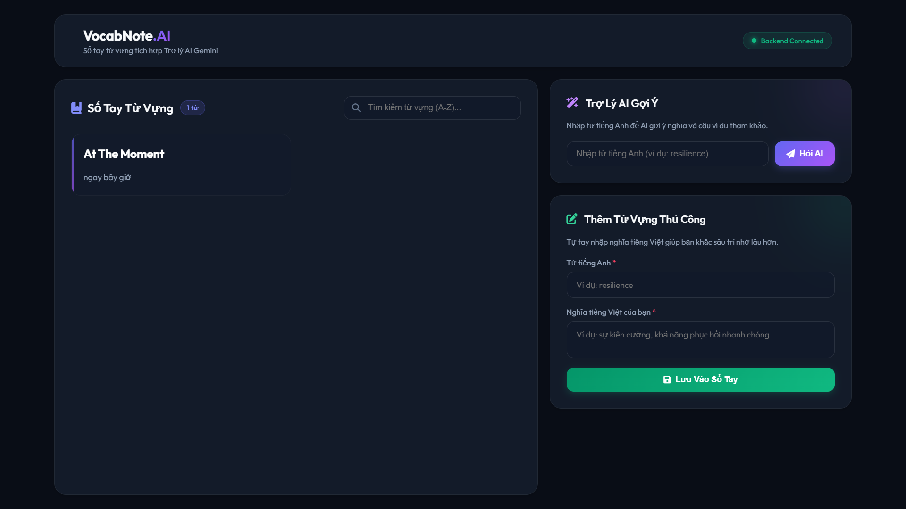

# VocabNote.AI 🧠✨

[](https://spring.io/projects/spring-boot)
[](#)
[](https://supabase.com/)
[](https://deepmind.google/technologies/gemini/)
[](#)

**VocabNote.AI** là một ứng dụng sổ tay từ vựng thông minh, kết hợp giữa phương pháp học tích cực (Active Recall) và công nghệ Trí tuệ nhân tạo (Generative AI). Thay vì tự động điền nghĩa tiếng Việt thụ động, ứng dụng cung cấp một **Trợ lý AI gợi ý nghĩa & ví dụ** để người học tham khảo, nhưng khuyến khích người dùng tự tay nhập và biên tập nghĩa của từ theo cách hiểu riêng để tối ưu hóa khả năng ghi nhớ dài hạn.

---

## 📸 Giao Diện Dự Án

Dưới đây là hình ảnh thực tế về giao diện làm việc của ứng dụng:



---

## 🚀 Tính Năng Nổi Bật

- 🎨 **Premium UI Dashboard:** Thiết kế tối giản, hiện đại theo phong cách **Glassmorphism** tối (Dark Mode) kết hợp các hiệu ứng chuyển động trơn tru (Micro-animations) mang lại trải nghiệm học tập lôi cuốn.
- ⚡ **Trợ lý AI Gemini:** Tra cứu từ vựng tiếng Anh tức thời. AI sẽ tự động phân tích để trả về nghĩa tiếng Việt gợi ý sát nhất và một câu ví dụ minh họa trực quan.
- 📝 **Phương pháp Ghi nhớ Chủ động (Active Recall):** Người dùng tự tay gõ nghĩa của từ để lưu trữ, giúp vỏ não vận động tốt hơn khi học từ mới.
- ✏️ **Chỉnh sửa/Xóa trực tiếp (Hover Actions & Inline Edit):**
  - Khi hover (rê chuột) vào thẻ từ vựng, các nút quản trị (Sửa/Xóa) sẽ tự động xuất hiện.
  - Nhấp vào **Sửa** sẽ chuyển thẻ từ vựng sang chế độ chỉnh sửa trực tiếp (Inline inputs) ngay tại chỗ rất mượt mà.
- 🔍 **Tìm kiếm Thời gian thực (Real-time Filter):** Hỗ trợ tìm kiếm từ vựng và nghĩa tiếng Việt đồng bộ theo bộ lọc A-Z tức thì khi bạn gõ.
- 🌐 **Hỗ trợ Cloud Native:** Cấu hình chuẩn hóa độc lập môi trường, hỗ trợ tốt kết nối qua Pooler bảo mật (IPv4-compatible) và sẵn sàng deploy lên Vercel, Render và Supabase.

---

## 🛠️ Công Nghệ Sử Dụng

### Backend (API Web Services)
- **Language:** Java 17
- **Framework:** Spring Boot 3.3.0 (Spring Web, Spring Data JPA)
- **Database Driver:** PostgreSQL JDBC Driver (Cấu hình ngắt caching Prepared Statement để tương thích với PgBouncer/Supabase Transaction Mode).
- **AI Integration:** Google Gemini API Client SDK (Spring RestTemplate)
- **APIs Docs:** Swagger UI / OpenAPI 3

### Frontend (User Interface)
- **Core:** HTML5, Vanilla JavaScript (ES6+)
- **Styling:** CSS3 Custom variables (Harmonious Slate/Indigo Palette, Blur backdrop filter)
- **Icons:** FontAwesome v6 (Premium vector icons CDN)
- **Build tool:** Node.js (tập lệnh tự động biên dịch config môi trường trước khi deploy Vercel).

### Database & Infrastructure
- **DBMS:** Supabase PostgreSQL Cloud
- **Cloud Hosting:**
  - Frontend: **Vercel**
  - Backend API: **Render** (chạy thông qua Docker container)

---

## 📐 Kiến Trúc Hệ Thống (System Flow)

```mermaid
graph TD
    Client[Vercel Frontend client]
    Render[Render Backend API]
    Gemini[Gemini Flash AI API]
    Supabase[Supabase PostgreSQL]

    Client -->|1. GET /api/v1/words/suggest?q=word| Render
    Render -->|2. Request Suggestion| Gemini
    Gemini -->|3. JSON Meaning & Example| Render
    Render -->|4. Return Suggested DTO| Client
    
    Client -->|5. POST /api/v1/words (Manual input)| Render
    Render -->|6. Check constraints & Save| Supabase
    
    Client -->|7. PUT/DELETE /api/v1/words/{id}| Render
    Render -->|8. Update/Delete row| Supabase
```

---

## ⚙️ Thiết Lập Môi Trường (Environment Variables)

### 1. Spring Boot Backend (Render hoặc Local)
Tạo tệp `.env` trong thư mục `backend/` hoặc khai báo biến hệ thống trên Render:
```env
# Mật khẩu database Supabase của bạn
DB_PASSWORD=your_supabase_password

# API Key lấy từ Google AI Studio
GEMINI_API_KEY=your_gemini_api_key
```

### 2. Frontend (Vercel)
Khai báo biến môi trường tại phần cài đặt dự án trên Vercel:
*   `BACKEND_URL` = `https://<tên-app-của-bạn>.onrender.com/api/v1/words`

---

## 💻 Hướng Dẫn Chạy Local

### 1. Khởi động Database PostgreSQL (Docker fallback)
Nếu không muốn dùng Supabase trực tiếp khi dev, hãy chạy database local bằng Docker:
```bash
docker compose -f database/docker-compose.yml up -d
```

### 2. Khởi động Backend API
Di chuyển vào thư mục `backend/` và khởi động Spring Boot:
```bash
cd backend
./mvnw spring-boot:run
```
*API sẽ lắng nghe tại cổng `8080`*. Tài liệu Swagger UI xem tại: [http://localhost:8080/swagger-ui.html](http://localhost:8080/swagger-ui.html)

### 3. Khởi động Frontend
Di chuyển vào thư mục `frontend/` và khởi động máy chủ thử nghiệm:
```bash
cd frontend
npm install
npm run dev
```
*Ứng dụng giao diện sẽ chạy tại địa chỉ: [http://localhost:3000](http://localhost:3000)*.

---

## ☁️ Quy Trình Deploy Lên Cloud

### Bước 1: Deploy Database Supabase
- Khởi tạo project PostgreSQL trên Supabase.
- Bật **Connection Pooling** trên Supabase dashboard, chọn chế độ **Transaction Mode** (Cổng `6543`).

### Bước 2: Deploy Backend trên Render
- Tạo mới một **Web Service** trên Render kết nối với GitHub.
- Thiết lập **Root Directory** là `backend` và **Runtime** là `Docker`.
- Khai báo đầy đủ 2 biến môi trường `DB_PASSWORD` và `GEMINI_API_KEY` trong mục Environment.

### Bước 3: Deploy Frontend trên Vercel
- Tạo dự án mới trên Vercel và chọn thư mục gốc là `frontend`.
- Khai báo biến môi trường `BACKEND_URL` trỏ về API Render.
- Nhấn **Deploy** để hoàn tất!
